# JWT Pizza Architecture

This document explains how the JWT Pizza frontend is organized, how data moves through the app, and where it connects to other systems. It is written for a new engineer who needs enough context to make changes confidently.

## High-level overview

JWT Pizza is a Vite + React + TypeScript single-page application. The frontend renders the customer, franchisee, and admin experiences in the browser and talks to backend APIs through a small service abstraction.

At runtime:

1. `index.html` loads `/index.tsx`.
2. `index.tsx` mounts React into `#root` and wraps the app in `BrowserRouter`.
3. `src/app/app.tsx` owns the top-level user session state, route table, header, breadcrumb, and footer.
4. Route views call `pizzaService`, which currently points at `HttpPizzaService`.
5. `HttpPizzaService` converts method calls into `fetch` requests against the configured JWT Pizza backend services.

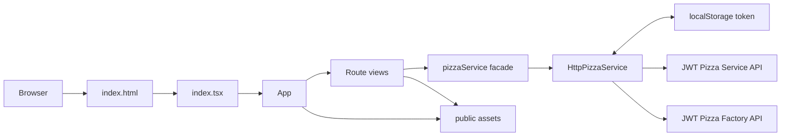

## Application structure

The important files and directories are:

| Path | Responsibility |
| --- | --- |
| `index.html` | Browser entry document. Includes `main.css`, root div, and the module script for `index.tsx`. |
| `index.tsx` | React entry point. Creates the root and installs `BrowserRouter`. |
| `src/app/app.tsx` | Top-level application shell, route registry, user session loading, Preline initialization, layout composition. |
| `src/app/header.tsx` | Responsive navigation. Shows links based on route display flags and constraint functions. Shows user initials when logged in. |
| `src/app/footer.tsx` | Footer navigation and app version display from `/version.json`. |
| `src/components` | Reusable UI pieces such as `Button`, `Card`, `Breadcrumb`, carousel, quotes, and slides. |
| `src/views` | Route-level pages for home, auth, ordering, delivery, dashboards, docs, and franchise/store mutations. |
| `src/service/pizzaService.ts` | Shared TypeScript domain types and the `PizzaService` interface. |
| `src/service/httpPizzaService.ts` | Concrete HTTP implementation of `PizzaService`. Handles API URLs, JSON requests, auth token headers, and error normalization. |
| `src/service/service.ts` | Exports the selected `pizzaService` implementation. This is the main integration point for replacing HTTP with a test or mock implementation. |
| `public` | Static assets served by Vite, including pizza images, logo/icon assets, and `version.json`. |
| `main.css` | Tailwind entry directives plus root page background sizing. |
| `tailwind.config.js` | Tailwind and Preline configuration, including the custom `wobble` animation used when selecting pizzas. |
| `deployService.sh` | Builds the app, writes a timestamped `dist/version.json`, copies the build to a remote host over SSH/SCP, then removes `dist`. |

## Core technologies

- React 18 renders the user interface.
- React Router 6 provides client-side routing through `BrowserRouter`, `Routes`, `Route`, `NavLink`, `useNavigate`, `useLocation`, and `useParams`.
- Vite builds and serves the app.
- Tailwind CSS provides utility-first styling.
- Preline provides interactive UI behavior, including navbar collapse, password visibility toggles, overlays, and tooltips.

Preline is imported once in `src/app/app.tsx`. Whenever the URL path changes, `App` calls `window.HSStaticMethods.autoInit()` so Preline scans the new route markup and wires up any declarative components.

## Routing model

Routes are defined as data in `src/app/app.tsx` through the `navItems` array. Each item includes a title, path, rendered component, optional display locations, and optional constraint functions.

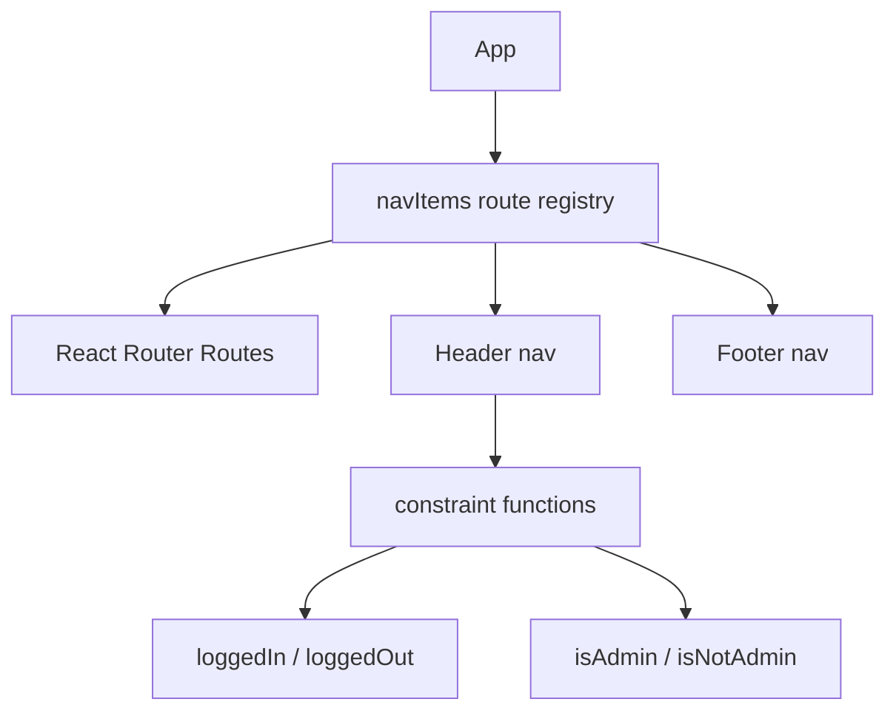

The main routes are:

| Route | View | Purpose |
| --- | --- | --- |
| `/` | `Home` | Marketing/home page with hero image, call to order, and carousel. |
| `/menu` | `Menu` | Loads menu and franchise stores; lets diners build an order. |
| `/payment` | `Payment` | Requires a logged-in user before submitting the order. Redirects to nested login when needed. |
| `/delivery` | `Delivery` | Shows the order JWT and lets the diner verify it with the factory API. |
| `/diner-dashboard` | `DinerDashboard` | Shows the current user's profile and order history. |
| `/franchise-dashboard` | `FranchiseDashboard` | Shows the current franchisee's franchise and stores, or a franchise sales page if they do not own one. |
| `/admin-dashboard` | `AdminDashboard` | Admin-only view of paged franchise/store data and admin mutation actions. |
| `/:subPath?/login` | `Login` | Logs in from root or from nested workflows such as `/payment/login`. |
| `/:subPath?/register` | `Register` | Registers from root or from nested workflows. |
| `/:subPath?/logout` | `Logout` | Clears API session/token and returns home. |
| `/:subPath?/create-franchise` | `CreateFranchise` | Creates a franchise and assigns an admin email. Usually entered from admin dashboard. |
| `/:subPath?/close-franchise` | `CloseFranchise` | Confirmation page for franchise deletion. |
| `/:subPath?/create-store` | `CreateStore` | Creates a store inside a selected franchise. |
| `/:subPath?/close-store` | `CloseStore` | Confirmation page for store deletion. |
| `/docs/:docType?` | `Docs` | Displays API documentation returned by the service or factory API. |
| `*` | `NotFound` | Catch-all route. |

The `/:subPath?` pattern is used to support nested workflow paths. For example, the payment page sends an unauthenticated user to `/payment/login`, and the login page uses `useBreadcrumb()` to navigate back to `/payment` with the same router state.

## Session and role handling

`App` owns `user` state:

- On first render, `App` calls `pizzaService.getUser()`.
- `HttpPizzaService.getUser()` only calls `/api/user/me` if `localStorage` has a `token`.
- If `/api/user/me` fails, the token is removed and the app treats the user as logged out.
- Successful login/register calls store the returned JWT in `localStorage` and update `App` state through `setUser`.
- Logout calls the API's auth delete endpoint, removes the local token, clears `App` state, and navigates home.

The app models roles in `src/service/pizzaService.ts`:

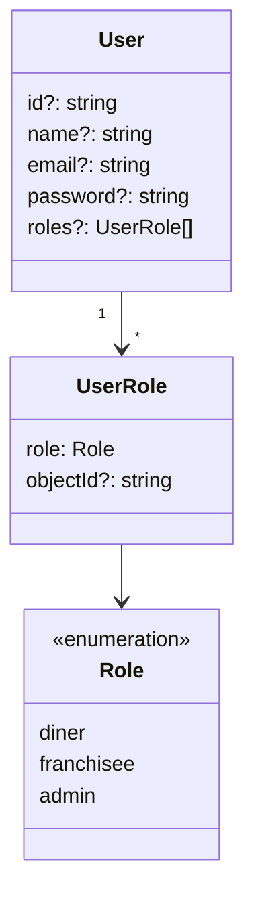

`Role.isRole(user, role)` is used by `App` and `AdminDashboard` to decide whether a user should see admin-only navigation/content. The UI hides some navigation links, but backend endpoints still need to enforce authorization because client-side checks can be bypassed.

## Service layer

The app uses a narrow domain service interface so views do not need to know about URLs, headers, JSON serialization, or token storage.

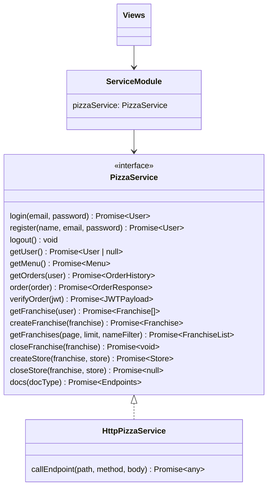

`src/service/service.ts` currently exports:

```ts
let pizzaService: PizzaService = httpPizzaService;
```

That small indirection is useful for tests or future local/demo implementations. Most views import only `pizzaService`.

### HTTP behavior

`HttpPizzaService.callEndpoint()` is the common request path:

1. Builds `fetch` options with JSON headers and `credentials: 'include'`.
2. Reads `localStorage.getItem('token')`.
3. Adds `Authorization: Bearer <token>` if a token exists.
4. JSON-stringifies the body when supplied.
5. Prefixes relative paths with `VITE_PIZZA_SERVICE_URL`.
6. Allows absolute URLs for calls to other services.
7. Parses the JSON response.
8. Resolves successful responses or rejects with `{ code, message }`.

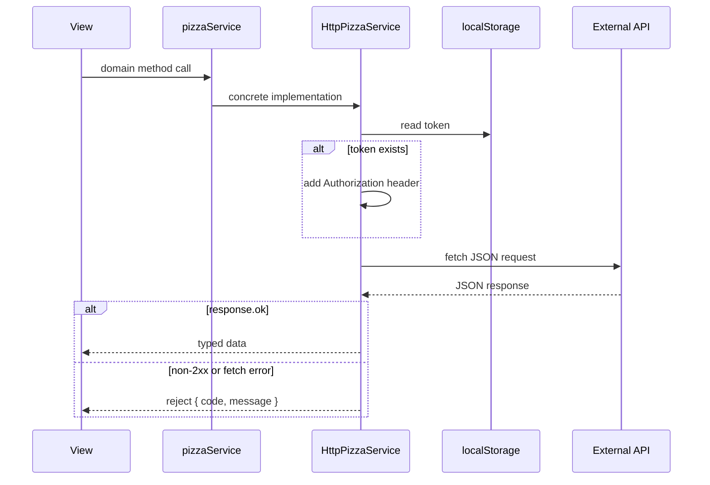

## External application and service connections

This frontend connects to several external or separately deployed systems:

| External system | Where configured/used | Purpose |
| --- | --- | --- |
| JWT Pizza Service API | `import.meta.env.VITE_PIZZA_SERVICE_URL` in `src/service/httpPizzaService.ts` | Primary backend for auth, user profile, menu, order history, order creation, franchise management, store management, and service API docs. |
| JWT Pizza Factory API | `import.meta.env.VITE_PIZZA_FACTORY_URL` in `src/service/httpPizzaService.ts` and `src/views/docs.tsx` | Verifies order JWTs and serves factory-specific API docs. |
| Browser `localStorage` | `HttpPizzaService.login`, `register`, `getUser`, `logout`, `callEndpoint` | Stores the JWT auth token under `token` and supplies it as a bearer token on API requests. |
| Browser cookies/session credentials | `HttpPizzaService.callEndpoint` via `credentials: 'include'` | Sends cookies for API requests when the API and browser are configured to use them. |
| Preline JavaScript | Imported in `src/app/app.tsx`; used through `window.HSStaticMethods`, `HSOverlay`, and `data-hs-*` attributes | Powers navbar collapse, password toggle, tooltips, and the JWT verification modal. |
| Unsplash image CDN | `src/views/dinerDashboard.tsx` | Loads the stock avatar image shown in the diner dashboard. |
| Public static assets | `public/*.png`, `public/*.jpg`, `public/version.json` | Images, logos, favicon, and runtime version display. |
| SSH/SCP deployment target | `deployService.sh` | Copies built static files to a remote Ubuntu host under `public_html/jwt-pizza`. |
| Telephone app/protocol | `tel:800-555-5555` link in `src/views/franchiseDashboard.tsx` | Lets a user start a phone call from supported devices. |

The two API base URLs are expected to be available as Vite environment variables at build/runtime:

```text
VITE_PIZZA_SERVICE_URL
VITE_PIZZA_FACTORY_URL
```

Because Vite only exposes variables prefixed with `VITE_`, new client-side environment values must use that prefix.

## Domain model

The core domain types live in `src/service/pizzaService.ts` and are shared by views and the service implementation.

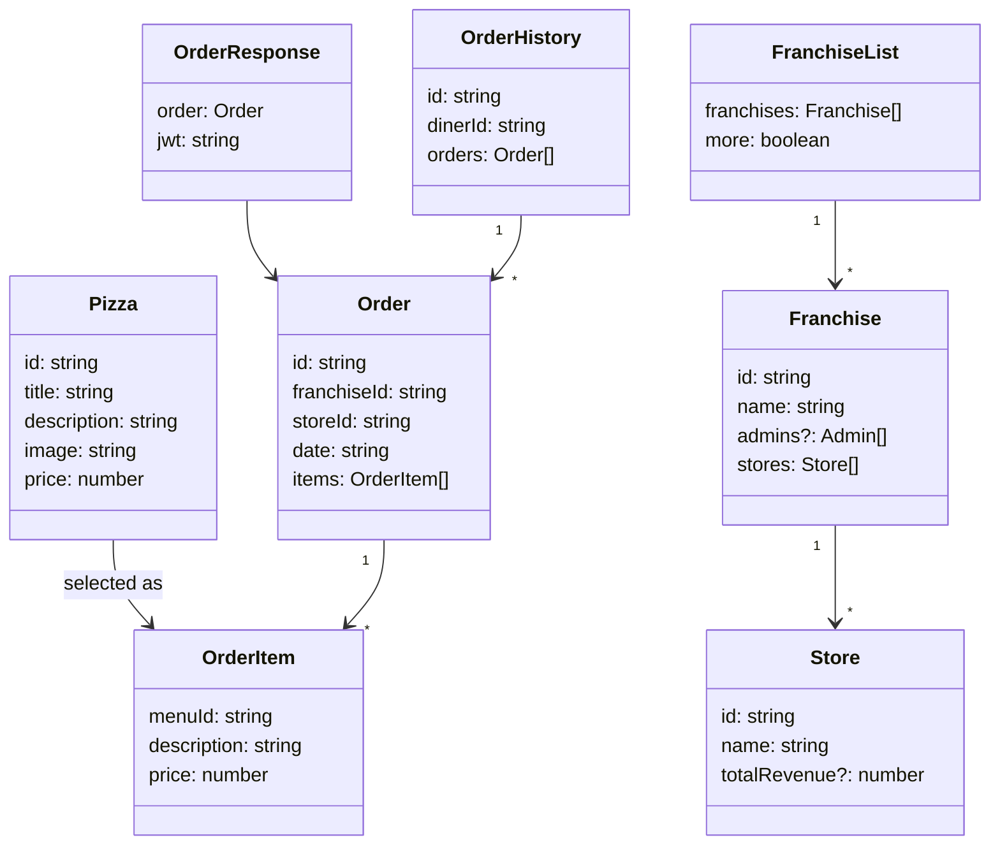

## Main user flows

### Login/register flow

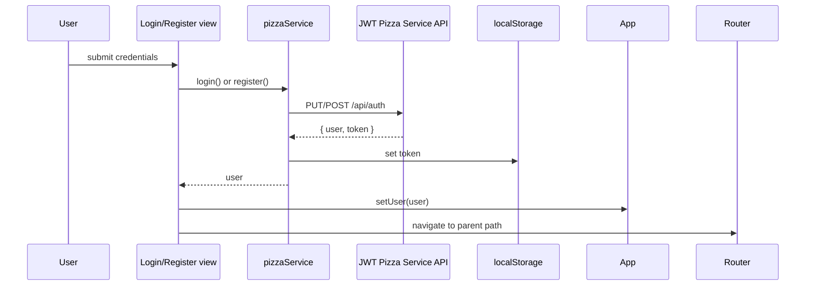

Login and registration both preserve router state when entered through a nested workflow. That is why unauthenticated checkout can resume after authentication.

### Order flow

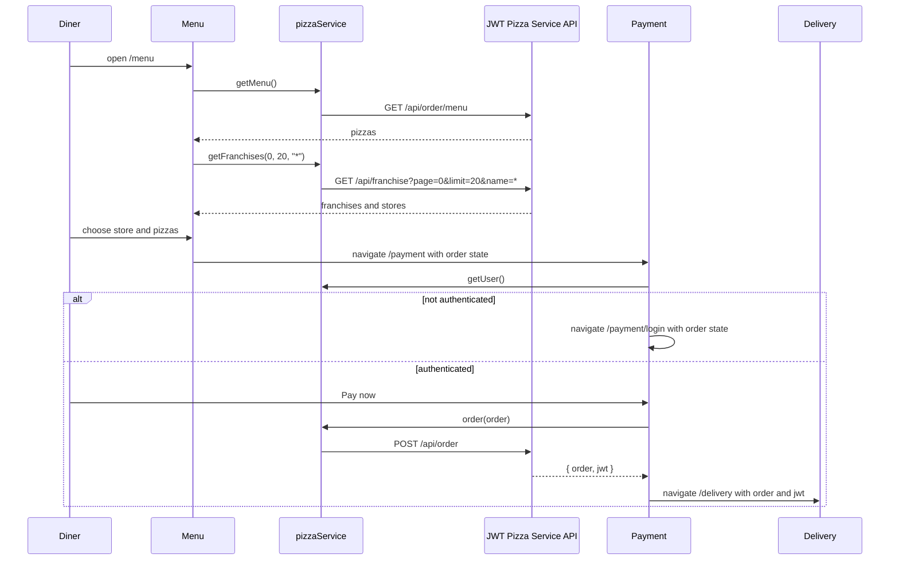

The order being built is kept in React component state inside `Menu` and passed to later pages using React Router `location.state`. It is not persisted across full page refreshes.

### JWT verification flow

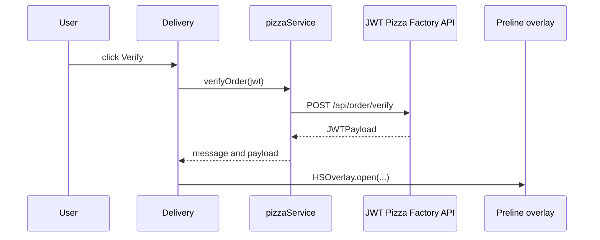

This is the clearest cross-application path: the order is created by the primary Pizza Service, but the JWT is verified by the Pizza Factory service.

### Franchise/admin management flow

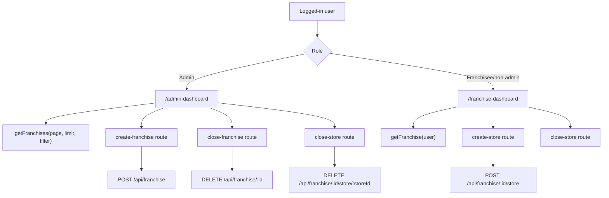

Admin and franchisee workflows reuse the same create/close route components. The selected `franchise` and `store` objects are passed through `location.state`, so those routes expect to be entered from the dashboard buttons.

## API endpoint mapping

The frontend method-to-endpoint mapping is centralized in `src/service/httpPizzaService.ts`.

| Service method | HTTP call | Backend |
| --- | --- | --- |
| `login(email, password)` | `PUT /api/auth` | Pizza Service |
| `register(name, email, password)` | `POST /api/auth` | Pizza Service |
| `logout()` | `DELETE /api/auth` | Pizza Service |
| `getUser()` | `GET /api/user/me` | Pizza Service |
| `getMenu()` | `GET /api/order/menu` | Pizza Service |
| `getOrders(user)` | `GET /api/order` | Pizza Service |
| `order(order)` | `POST /api/order` | Pizza Service |
| `verifyOrder(jwt)` | `POST {VITE_PIZZA_FACTORY_URL}/api/order/verify` | Pizza Factory |
| `getFranchise(user)` | `GET /api/franchise/:userId` | Pizza Service |
| `createFranchise(franchise)` | `POST /api/franchise` | Pizza Service |
| `getFranchises(page, limit, nameFilter)` | `GET /api/franchise?page=:page&limit=:limit&name=:nameFilter` | Pizza Service |
| `closeFranchise(franchise)` | `DELETE /api/franchise/:franchiseId` | Pizza Service |
| `createStore(franchise, store)` | `POST /api/franchise/:franchiseId/store` | Pizza Service |
| `closeStore(franchise, store)` | `DELETE /api/franchise/:franchiseId/store/:storeId` | Pizza Service |
| `docs(docType)` | `GET /api/docs` or `GET {VITE_PIZZA_FACTORY_URL}/api/docs` | Pizza Service or Pizza Factory |

## UI composition

Most route pages are wrapped in `View`, which supplies the shared slate background and gradient heading treatment. `Header`, `Breadcrumb`, `main`, and `Footer` are composed in `App`.

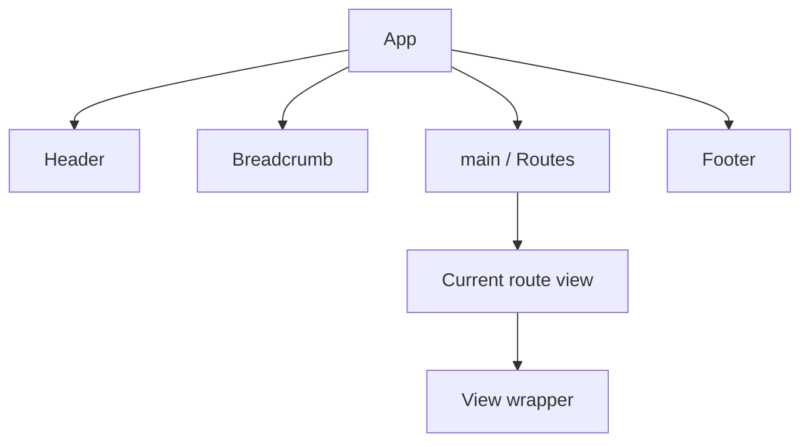

Reusable UI components are intentionally simple:

- `Button` centralizes the orange button styling and supports `submit`, `disabled`, and `className`.
- `Card` renders menu pizza cards using images returned by the backend menu API.
- `Breadcrumb` derives clickable breadcrumb links from the current path string.
- `Carousel`, `Slide`, and `Quote` support the home page testimonials.

## Navigation state and breadcrumbs

`src/hooks/appNavigation.tsx` exports `useBreadcrumb(sibling?)`. It:

1. Reads the current path with `useLocation()`.
2. Removes the final path segment.
3. Optionally appends a sibling segment such as `register` or `login`.
4. Navigates there while preserving `location.state`.

Examples:

- From `/payment/login`, `useBreadcrumb()` returns to `/payment`.
- From `/payment/login`, `useBreadcrumb('register')` goes to `/payment/register`.
- From `/admin-dashboard/create-franchise`, `useBreadcrumb()` returns to `/admin-dashboard`.

This hook is why order state can move through login/register and why mutation confirmation pages return to their dashboard.

## Build and deployment

Local development:

```sh
npm install
npm run dev
```

Production build:

```sh
npm run build
```

`deployService.sh` automates a specific SSH-based deployment:

1. Requires `-k <pem key file>` and `-h <hostname>`.
2. Runs `npm run build`.
3. Writes a timestamp version into `dist/version.json`.
4. Clears the remote `services/jwt-pizza` directory.
5. Copies `dist/*` to `ubuntu@<hostname>:public_html/jwt-pizza`.
6. Removes the local `dist` directory.

Note that the script currently clears `services/jwt-pizza` but copies into `public_html/jwt-pizza`; confirm that this is intentional before changing deployment behavior.

## Important implementation notes

- The app is a client-side SPA. Direct visits to nested routes require the static host to fall back to `index.html`; otherwise refreshes on routes such as `/payment` may 404 at the web server level.
- `localStorage` stores the auth token. This makes auth state survive page reloads, but token handling is visible to browser JavaScript.
- `callEndpoint()` always parses responses as JSON. API endpoints are expected to return JSON for both success and error cases.
- `Payment`, `CreateStore`, `CloseStore`, and `CloseFranchise` depend on `location.state`. A refresh or direct link to those pages may leave required state missing.
- UI role checks affect visibility, not security. Authorization must be enforced by the backend.
- `getOrders(user)` accepts a `user` argument but does not use it in the HTTP implementation; the backend infers the diner from authentication.
- The `PizzaService` interface signature for `register` names parameters differently than the implementation. The implementation and callers use `(name, email, password)`.
- Public images referenced with leading slashes, such as `/jwt-pizza-icon.png`, are served from `public`.
- Menu pizza images come from the API response and are rendered directly by `Card`.

## Where to add new behavior

- Add a new page by creating a component in `src/views`, then adding an entry to `navItems` in `src/app/app.tsx`.
- Add a new backend call by extending `PizzaService` in `src/service/pizzaService.ts`, implementing it in `HttpPizzaService`, and calling it from a view.
- Add shared domain types in `src/service/pizzaService.ts` so views and service implementations stay aligned.
- Add shared UI elements under `src/components` when multiple views need the same interaction or visual pattern.
- Add nav visibility rules as constraint functions in `App` when the rule depends on login or roles.
